# Market Anomaly Detection

End-to-end anomaly detection pipeline for MSFT hourly market data.

## Project Structure

- data/ - Raw and processed datasets
- market_anomaly_detection/ - Source package
- models/ - Trained models and artifacts
- notebooks/ - Analysis notebooks
- references/ - Supporting materials
- reports/ - Generated analysis outputs

This layout follows the Cookiecutter Data Science structure.

## Quick Start & Setup

This project uses `uv` as its package manager. The environment is fully cross-platform (Windows, macOS, and Linux).

### 1. Setup Environment
First, ensure you have [`uv` installed](https://docs.astral.sh/uv/). Then, from the project root:

*(Fallback: If you don't use `uv`, you can also run `pip install -r requirements.txt`)*

**macOS / Linux:**
```bash
# Sync dependencies and create environment
uv sync

# Activate the environment
source .venv/bin/activate
```

**Windows:**
```powershell
# Sync dependencies and create environment
uv sync

# Activate the environment
.venv\Scripts\activate
```

### 2. Run the Pipeline
The project includes a `Makefile` to simplify running commands.

**macOS / Linux:**
```bash
make run
```

**Windows:**
```powershell
.\make run
```

## Python Usage

You can use the pipeline directly inside Python scripts or Jupyter Notebooks:

```python
from market_anomaly_detection.execution.runner import main

# Run pipeline and save outputs
main()

# Run without saving outputs
main(write_outputs=False)
```

## CLI Usage

If you want to manually run the pipeline through the CLI without using `make`:

```bash
uv run python -m market_anomaly_detection.execution.runner
```
To disable writing output files:
```bash
uv run python -m market_anomaly_detection.execution.runner --no-output
```

## Data

Raw data lives in data/raw/. Use data/processed/ for intermediate outputs.

## Notebooks

Notebooks are stored in notebooks/ and follow the naming convention:

```
<order>.<initials>-<short-description>.ipynb
```

## Artifacts

The pipeline writes trained artifacts and metadata into models/:

- data_scaler.joblib
- pca_model.joblib
- pca_scaler.joblib
- isolation_forest.joblib
- lof.joblib
- combined_ensemble_model.joblib
- config.json
- summary.json

## Outputs

See the generated outputs and plots index in [reports/outputs-index.md](reports/outputs-index.md).

## System Architecture

The project follows a modular architecture defined as follows:




- **Data Layer (market_anomaly_detection/data_processing/)**: Responsible for loading and cleaning the raw datasets, as well as calculating financial metrics (features).
- **Anomaly Models Layer (market_anomaly_detection/anomaly_models/)**: Contains the core algorithmic detection models (ZScoreDetector, IQRDetector, IsolationForestDetector, LOFDetector) strictly adhering to the BaseAnomalyDetector interface.
- **Post Analysis Layer (market_anomaly_detection/post_analysis/)**: Provides tools like PCA and correlation logic to interpret the anomaly statistics.
- **Visualization Layer (market_anomaly_detection/visualization/)**: Contains Plotly wrappers for charting price action and scattering PCA components.
- **Pipeline Core (market_anomaly_detection/pipelines/)**: The MarketAnomalyDetectionPipeline orchestrates the flow from raw data ingestion to generating final html/csv artifacts.

## Development

Format and lint the codebase using `ruff`:

**macOS / Linux:**
```bash
make format
make lint
make test
```

**Windows:**
```powershell
.\make format
.\make lint
.\make test
```

### Updating the Architecture Diagram

If you modify the architecture, you can update the diagram by editing `references/architecture_diagram.mmd` and then running:

**macOS / Linux:**
```bash
make diagram
```

**Windows:**
```powershell
.\make diagram
```

*(This uses `npx @mermaid-js/mermaid-cli` under the hood to compile the `.mmd` file into the `.svg` image).*
